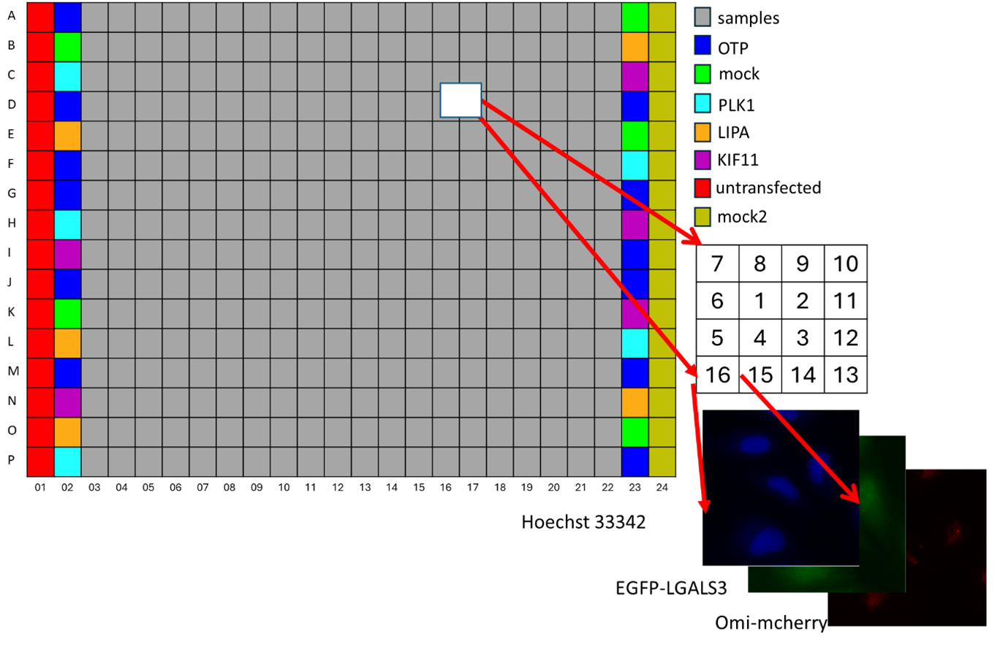
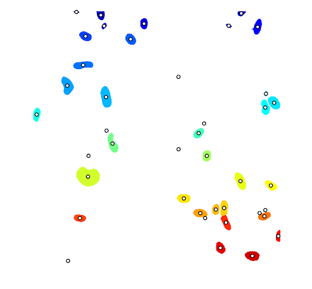

The steps of "The microscopy nuclei segmentation for cell death project" can be followed through https://salmakazemirashed.github.io/Cell_Microscopy_project/ documentation workflow
or through following steps.

# Conda Environment

For training UNet models We have created a Conda environment and export it
through:
```console
conda env export --from-history
```

It is possible to recreate conda env through
```console
conda env create -f environment.yml
```
and run the code in that environment or use the containerized version.

# Apptainer container
For creating an apptainer image of conda environment a docker definition file is defined as follows:
```bash
Bootstrap: docker

From: continuumio/miniconda3

%files
    environment_ubuntu.yml

%post
    conda env create -f environment_ubuntu.yml

%runscript
    exec conda/envs/$(head -n 1 environment.yml | cut -f 2 -d ' ')/bin/"$@"
```


The Windows Subsystem for Linux (WSL) tool were installed as well as Apptainer.

In ubuntu terminal the singulairity/apptainer image(.sif) file were built.

```bash
sudo apptainer build docker_def.def container_name.sif
```

and then activate the apptainer shell:

```bash
apptainer shell your-container-name.sif
```


# Preprocessing

The original images were in .C01 microcopic format stored on [Swestore](https://docs.swestore.se/).


## Access to Swestore

For accessing Swestore, we have used two different tools.

#### Lftp

First, we have used lftp through terminal: 
```bash
lftp https://username@webdav.swestore.se/snic/folder/
```

For downloading whole plate we used:
```bash
get plate_number.tar.gz
```

For uploading files we have used:
```bash
put plate_number.tar.gz
```

#### WinSCP

The other way to access files on Swestore was winscp tool which is a win-based tool.


## Format conversion

For extracting and converting the format of images we have used "bfconvert" function of [bftools](https://docs.openmicroscopy.org/bio-formats/5.7.1/users/comlinetools/index.html) command line tool. 

This is conducted through command line or  preprocessing/extract_conversion.py script and subprocess library.

## Normalization script

The following command should run over images after bfconvert command to normalize images to 8-bit format,

```bash
ls *.png ; while read file; do convert file -auto-level  -depth 8 -define quantum:format=unsigned -type grayscale file; done
```

or through extract_conversion.py script.


## Check validity of plates

For a correct, complete plate we should have A-P rows as well as 01-24 columns (6144).



with the following command we could see if each well (A01-P24) and 16 images per well exist.


```bash
ls | cut -d _ -f 3 | cut -b 1-3 | sort |  uniq -c 
```

# U-Net training

For training U-Net models, the code is taken and modified from [carpenterLab](https://github.com/carpenterlab/unet4nuclei/tree/master/unet4nuclei).


## Annotation

For training UNet models, some images are taken from [Broadinstitute](https://bbbc.broadinstitute.org/) as well as annotated masks for similarity of these images to
Our own images. However, we had to annotate more of our own images and combine them with online available images.
For this purpose, we have used cvat tool.

#### cvat

How we used:
```bash
 git clone https://github.com/opencv/cvat
 cd cvat
```


Run docker containers. It will take some time to download the latest CVAT release and other required images like postgres, redis, etc. from DockerHub and create containers.
```bash
 docker compose up -d
```
(Optional) Use CVAT_VERSION environment variable to specify the version of CVAT you want to install specific version (e.g v2.1.0, dev). Default behavior: dev images will be pulled for develop branch, and corresponding release images for release versions.
```bash
CVAT_VERSION=dev docker compose up -d
```

Alternative: if you want to build the images locally with unreleased changes see How to pull/build/update CVAT images section
You can register a user but by default, it will not have rights even to view the list of tasks. Thus you should create a superuser. A superuser can use an admin panel to assign correct groups to other users. Please use the command below:

```bash
sudo docker exec -it cvat_server bash -ic 'python3 ~/manage.py createsuperuser'
```

If you don’t have winpty installed or the above command does not work, you may also try the following:


```bash
# enter docker image first
docker exec -it cvat_server /bin/bash
# then run
python3 ~/manage.py createsuperuser
```
Choose a username and a password for your admin account.
Open the installed Google Chrome browser and go to localhost:8080. 
Type your login/password for the superuser on the login page and press the Login button. Now you should be able to create a new annotation task. 

I also had to download docker desktop. Now I only open that and run cvat container on that. 
Then open localhost:8080 on my browser. In cvat also I can define projects and labels.
Then add a job and start to annotate. Annotations are polygons and not polyline. 


## Published Datasets

The annotated datasets are published.


[Nuclei](https://www.sciencedirect.com/science/article/pii/S2352340922009726)


[Cytosol](https://www.sciencedirect.com/science/article/pii/S2352340924011107)


## Preprcoessing

After exporting annotation masks from cvat, train/UNet/preprocessing.py script will run over masks to create boundary images.

```bash
python3 preprocessing.py
```
example of raw annotated image


Three class (background, inside and boundary pcs) images are as follows:


## Training

After having directories in the following order:

```plaintext
UNet/
├── data
│   ├── 0_raw_images
│   ├── 1_raw_annotations
│   ├── 2_norm_images
│   ├── 2_norm_images_merged
│   ├── 3_boundary_labels
│   └── 4_filelists
│       ├── TEST.txt
│       ├── training.txt
│       └── VALIDATION
├── src
│   ├── utils
│   ├── preprocessing.py
│   ├── training.py
│   ├── prediction.py
│   ├── evaluation.ipynb
│   ├──experiments
│       ├── experiment_name
│       │   ├── models
│       │   │   ├── model_xxx.hdf5
│       │   ├── log.csv
│       │   ├── model.hdf5
│   └── experiment_name
│       ├── out
│       │   │   ├── prob
│       │   │   └── segm

```


we trained models with:

```bash
python3 training.py
```

## Prediction


we predicted the segmentation masks of validation and test images with the best model:

```bash
python3 prediction.py
```

# HoVer-Net training


The code of HoVer-Net taken from 

```bash
git clone https://github.com/vqdang/hover_net.git
```

The data required to be in .mat format as having centeroind points of objects. This has been done through find_middle_point.m script written in MATLaB.

An example of annotated masks with centric points:




The training, prediction and evaluation scripts for HoverNet are as follows:


```plaintext
HoverNet/
├── src
│   ├── find_middle_point.m
│   ├── extract_patches.py
│   ├── run_train.py
│   ├── run_train.sh
│   ├── run_infer.py
│   ├── epoch_run.sh
│   ├── run_infer.sh
│   ├── plot_train_loss.ipynb
├── dataset
│   ├──Train
│       ├── Images
│       │       ├──*.png
│       └── Labels
│       │       ├──*.mat
│   ├──Test
│       ├── Images
│       │       ├──*.png
│       └── Labels
│       │       ├──*.mat
├── output
│   ├──epoch_out
│       ├── json
│       ├── mat
│       ├── overlay
│       ├── qupath


```

We have run hovernet pytorch version using the conda env provided [here](https://github.com/vqdang/hover_net.git). 
and also updating as follows:

```bash
pip install torch==1.7.1+cu110 torchvision==0.8.2+cu110 torchaudio===0.7.2 -f https://download.pytorch.org/whl/torch_stable.html

```

extract_patches.py has been used for extracting smaller patches from train set saved as .npy numpy arrays.

For fine-tuning HoverNet model hovernet_original_consep_notype_tf2pytorch.tar pretrained model were used from pre_models directory.

We trained hovernet with 130 images (100 from BBBC and 30 from Aits training images) and validated and tested on test and validation set from [here.](https://www.sciencedirect.com/science/article/pii/S2352340922009726)
 
```bash
#!/usr/bin/env bash
#SBATCH --gpus 4
#SBATCH -A project_name
#SBATCH -t 3:00:00
#SBATCH -n 5
python run_train.py --gpu='0,1,2,3' > nuclei_results.txt
```


For validating models, we have run run_infer.py function for all models in every epoch.
```bash
#!/usr/bin/env bash
#SBATCH -n 3 --gpus=2
##SBATCH --gpus 10
#SBATCH -A project_name
#SBATCH -t 30:00:00

for VARIABLE in `seq 1 50`
do
python run_infer.py --model_path="logs/00/net_epoch=${VARIABLE}.tar" --model_mode='original' tile --input_dir='../dataset/Test/Images' --output_dir="output/${VARIABLE}"

done
```


We have plotted the training MSE loss of HoverNet for segmentation part as follows:


However, for choosing the best model among U-Net models and HoVer-Net models we have used the same evaluation scripts from U-Net repo.


# Evaluation

For evaluating the models we have used validation and test sets from  [Nuclei](https://www.sciencedirect.com/science/article/pii/S2352340922009726).

We have compared two metrics as pixel-based Jaccard index and object-based F1-score where the threshold for comparing two objects are 90%.

The metrics that we have used for both architectures are Jaccard Index and F1-score where they both are defind based on Intersection over Union (IOU),
The IoU measures the overlap of predicted and annotated objects and is calculated according to the following equation:

```{math}
IOU(A,B) = \dfrac {A \cap B }{A\cup B}
```

IoU determines Jaccard Index as a pixel-based index that can range from 0 to 1, from no overlap to identical objects. 
Since overlap of predicted and original objects is rarely 100\% we selected a few different thresholds for comparison (50\% to 90\%). This is for calculating F1-score which is an object-based index. F1-score measures how many out of all predictions were true positives as the geometric average between the recall and precision.


## U-Net evaluation

For evaluating U-Net models we have used our three best models as Model3, Model12, and Model14 where in the main manuscript we have mentioned 
the different training sets that they were trained on. 
The whole evaluation process of U-Net models are described in evaluation/UNet/UNET_concise_Evaluation.ipynb

The required functions are mostly taken from  [carpenterlab](https://github.com/carpenterlab/unet4nuclei.git) repo and revised according to our models and data.
Besides, a classification of Tiny, Small, Normal and Large nuclei is also performed to see in which category the models work best.
Then Jaccard index were calculated based on IOU and then by assigning a threshold, F1-score were calculated.

The following table shows the results for each U-Net model on test set.


|   |F1_score_90   | Average Jaccard Index    |  False Discovery Rate |  Precision  | Recall |
|---|--------------|--------------------------|----------------------|-------------|--------|
|3  | 0.8099       | 0.87                     | 0.066                |    0.934    |  0.729 |
|12 | 0.8061       | 0.88                     | 0.038                |    0.962    |  0.702 |
|14 | 0.8461       | 0.88                     | 0.063                |    0.937    |  0.766 |


## HoVer-Net evaluation

For evaluting the performnace of HoVer-Net models on validation and test set (same as UNet from [Nuclei](https://www.sciencedirect.com/science/article/pii/S2352340922009726))
we have used loadmat function from scipy.io python library and then we compared the "inst_map" feature of ".mat" files as predicted masks to be able to compare to gold annotated segmentation masks.

Same as UNet evaluation process, small objects (minsize = 25) were removed during comparison. 
The whole evaluation process of HoVer-Net models are described in evaluation/HoVerNet/HoverNet_concise_evaluation.ipynb.

The following table shows the results for the best three top models of  HoVer-Net architecture valiadated on test set.


|   |F1_score_90   | Average Jaccard Index    |  False Discovery Rate |  Precision  | Recall |
|---|--------------|--------------------------|----------------------|-------------|--------|
|17 | 0.7551       | 0.83                     | 0.110                |    0.890    |  0.688 |
|23 | 0.7487       | 0.82                     | 0.128                |    0.872    |  0.690 |
|37 | 0.7725       | 0.83                     | 0.109                |    0.891    |  0.711 |


# Full pipeline

After conducting accurate annotations published in [Nuclei](https://www.sciencedirect.com/science/article/pii/S2352340922009726) and [Cytosol](https://www.sciencedirect.com/science/article/pii/S2352340924011107),
training U-Net and HoVer-Net models for segmenting the nuclei channel, we have compared the top 3 best models from each architecture and at the end we have used the best U-Net model that we have trained on
our own annotated images as well as some images from [BBBC](https://bbbc.broadinstitute.org/) image set.
The model's performance on test set were validated where it had 85% F1-score on 90% overlapping threshold and 88% average Jaccard index.


The experiment were conducted in two Oxidative stress (A, B) and non-oxiditive stress (C,D) groups each group has one repetition all saved in 79 groups for almost 18000 genes.
The status of each group of raw data and how we proceeded to analyse is summarized in progress_log/plateProgress_done.xlsx file.
Some of plates were missing or there were several copies. We had to deal with missing or repeated data.


The overall process for each plate is as follows:
1)	Download from swestore
2)	Run extract_conversion.py script over plates to extract only d0 channel.
3)	Normalize them to 8bit images using bash command
4)	Save the names in 4_filelist folder  and remove .C01 from  the folder and only keep .png ones (6144 images in each full plate) 
5)	Copy  and run prediction model over them
6)	Run area_size.py script over them and copy the files to A, or B, or C, or D 
7)	Run the plot and visualization scripts over all of them


## Download and Extract

For downloading plates from Swestore, we have used:


```bash
lftp https://username@webdav.swestore.se/snic/folder/
```

For downloading whole plate we used:
```bash
get plate_number1.tar.gz plate_number2.tar.gz ...
```

For extracting and converting the format of images we have used "bfconvert" function of [bftools](https://docs.openmicroscopy.org/bio-formats/5.7.1/users/comlinetools/index.html) command line tool. 

This is conducted through command line or  preprocessing/extract_conversion.py script and subprocess library.


The following command should run over images after bfconvert command to normalize images to 8-bit format,

```bash
ls *.png ; while read file; do convert file -auto-level  -depth 8 -define quantum:format=unsigned -type grayscale file; done
```

or through extract_conversion.py script.

Besides, We extracted multi plates through :

```bash
for FILE in *.tar.gz; do
    echo ${FILE} | cut -d '/' -f 3
    sbatch -A  project_name -n 1 -t 5:00:00 --wrap="python extract_conversion.py  $(echo ${FILE}|cut -d '/' -f 3)" 
    sleep 1 # pause to be kind to the scheduler
done

```


## Image list


```bash
ls  *.png > ../4_filelists/plate_num_names.txt
```


## Run Prediction script

For running prediction script we have used CPU multi-thread parallel prediction and gpu by adding following parts to the code.

```python
global model
global graph

from concurrent.futures import ProcessPoolExecutor, ThreadPoolExecutor, as_completed
from multiprocessing import cpu_count

with open(path_files_list) as image_list:
    image_names_all = [os.path.join(path_files + sys.argv[1]+'/', f.strip()) for f in image_list]


clear_session()

model = utils.model_builder.get_model_3_class(1104, 1104,1)                                             
model.load_weights('model_14.hdf5')  ## loading best model here from UNet models
model._make_predict_function()
tf.Graph()
graph = tf.get_default_graph()
test = [prediction_images(image_names_all[i_batch*128:(i_batch+1)*128]) for i_batch in range(48)]  ## use this if you do not want multi-threading


## use this if you want multi-threading
CPU_LIMIT=128  ## This is the cluster limit
with ThreadPoolExecutor(min(CPU_LIMIT,cpu_count())) as executor:
    print('befoooooooooooooooooore submit function')
    futures=[executor.submit(prediction_images ,image_names_all[i_batch*16:(i_batch+1)*16]) for i_batch in range(384)]#range(len(image_names_all))] 

    for future in as_completed(futures):
        res=future.result()
        print('resssssssssssssuuuuuuuuuuuuuult: ',res)
 

```

We have also predict several plates using only gpu by

```bash
python run_prediction.py
```

where, we have 

```python
import subprocess

subprocess.run("python prediction.py MFGTMPcx7_170801050001 ../data/4_filelists/MFGTMPcx7_170801050001_names.txt", shell=True)
subprocess.run("python prediction.py MFGTMPcx7_170801100001 ../data/4_filelists/MFGTMPcx7_170801100001_names.txt", shell=True)
...
```

## Area and Number of Nuclei

After running prediction script, for every plate, a "segm" folder was created where the predicted segmentation masks were stored. By running pipeline/plate_script/area_count.py

We will have a .csv file for each plate where we have three columns as follows. 


|Pred_Object   | Image_name                              |  Area  | 
|--------------|-----------------------------------------|--------|
| 0            | MFGTMPcx7_170525180001_A01f00d0.png     |   141  |
| 1            | MFGTMPcx7_170525180001_A01f00d0.png     |   1545 | 
| 2            | MFGTMPcx7_170525180001_A01f00d0.png     |   2179 | 
| -            | -                                       |   -    | 


## Visualization

This then saved and averaged for all wells for each plate and connected to the gene that were knocked-down at that well. The visualization and numercial results are all in 
screen_visualization and results directories.


